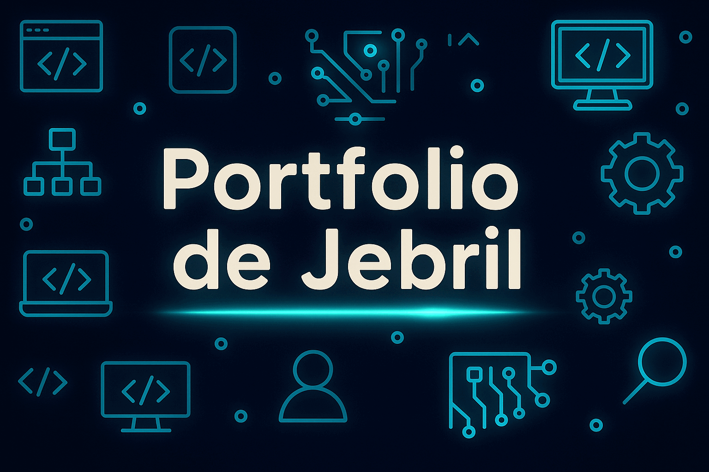

---

# 📁 Portfolio de Jebril

Bienvenue dans mon portfolio personnel, développé en PHP, HTML, CSS et MySQL. Ce projet regroupe mes créations web, mes outils, mes expérimentations et mes projets d’apprentissage. Il est entièrement dynamique et administrable via une interface d’ajout de projets.

---

## 🧰 Fonctionnalités

- **Ajout de projets** via un formulaire sécurisé (PDO + POST)
- **Base de données MySQL** pour stocker les projets
- **Affichage dynamique** des projets avec grille responsive
- **Navigation latérale** pour explorer les sections du portfolio
- **Design personnalisé** avec CSS sombre et effets visuels
- **Organisation par sections** : compétences, formations, expériences, soft skills, centres d’intérêt…

---

## 🧪 Projets intégrés

Voici quelques projets déjà intégrés dans le portfolio :

| Projet              | Description                                      | Lien local                          |
|---------------------|--------------------------------------------------|-------------------------------------|
| 🎨 Portfolio         | Interface principale du site                     | `http://localhost/portfolio/`       |
| 🧬 Jeu de la Vie     | Simulation cellulaire en PHP                     | `http://localhost/Foitih-Jebril-jeu-de-la-vie/` |
| 📋 Task Manager      | Gestionnaire de tâches                          | `http://localhost/task_manager/`    |
| 🧠 Kaguya            | Projet expérimental (à détailler)                | `http://localhost/kaguya/`          |
| 🧾 CV interactif     | Page de présentation personnelle                 | `http://localhost/Projet-CV/`       |
| 🐾 Pokedex           | Catalogue Pokémon en PHP                         | `http://localhost/pokedex.local/`   |

---

## 🛠 Technologies utilisées

- **Frontend** : HTML5, CSS3, JavaScript (optionnel)
- **Backend** : PHP orienté objet
- **Base de données** : MySQL via PDO
- **Sécurité** : Préparation des requêtes SQL (anti-injection)
- **Design** : Flexbox, Grid, effets CSS, dark mode

---

## 📦 Structure du projet

```
/portfolio/
│
├── db.php               → Connexion à la base de données
├── ajouter_projet.php   → Formulaire d’ajout de projet
├── afficher_projets.php → Grille des projets
├── index.php            → Page d’accueil
├── style.css            → Feuille de style principale
├── /projets/            → Dossiers des projets individuels
└── /assets/             → Images et ressources
```

---

## 🚀 Installation locale

1. Cloner le projet dans `htdocs` ou `www`
2. Créer une base de données `portfolio`
3. Importer la table `projects` :

```sql
CREATE TABLE projects (
  id INT AUTO_INCREMENT PRIMARY KEY,
  titre VARCHAR(255),
  description TEXT,
  image VARCHAR(255),
  technos VARCHAR(255),
  lien VARCHAR(255),
  etat VARCHAR(50),
  date_creation TIMESTAMP DEFAULT CURRENT_TIMESTAMP
);
```

4. Modifier les identifiants dans `db.php` si nécessaire
5. Lancer `http://localhost/portfolio/` dans le navigateur

---

## ✨ À venir

- Ajout d’un système de tags par technologie
- Filtrage des projets par état ou catégorie
- Interface d’édition/suppression des projets
- Version mobile responsive

---

Tu veux que je t’aide à générer une bannière SVG pour ton portfolio, ou à rédiger une version anglaise du README pour GitHub international ? Je peux te booster ça en mode vitrine pro 🌍🔥
